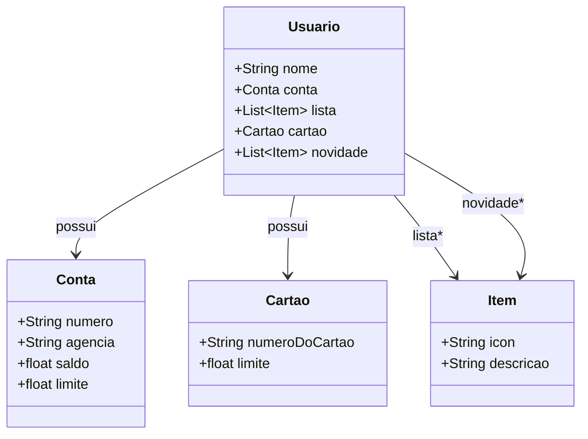

## Diagrama de classe

```mermaid
classDiagram
    class Usuario {
        +String nome
        +Conta conta
        +List~Item~ lista
        +Cartao cartao
        +List~Item~ novidade
    }

    class Conta {
        +String numero
        +String agencia
        +float saldo
        +float limite
    }

    class Cartao {
        +String numeroDoCartao
        +float limite
    }

    class Item {
        +String icon
        +String descricao
    }

    Usuario --> Conta : possui
    Usuario --> Cartao : possui
    Usuario --> Item : lista*
    Usuario --> Item : novidade*
```
